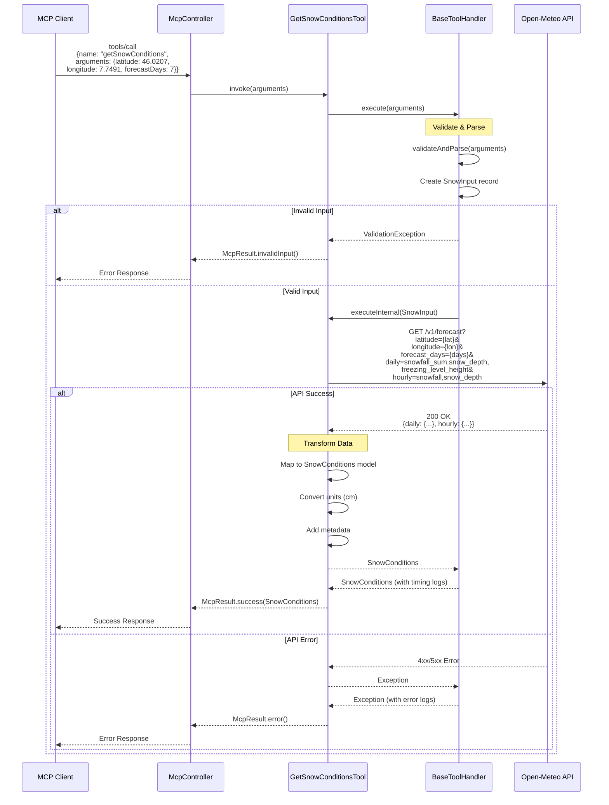

# Get Snow Conditions - Tool Specification

**Tool Name**: `getSnowConditions`  
**Category**: `weather`  
**Status**: Production Ready  
**External API**: Open-Meteo API (https://open-meteo.com)  
**Version**: 1.1.0  
**Migrated to BaseToolHandler**: ✅ Yes (Phase 2a)

---

## Overview

The `getSnowConditions` tool fetches detailed snow conditions and forecasts for ski resorts and mountain locations using the Open-Meteo API. Provides snow depth, fresh snowfall, freezing level, and winter sports-specific weather data.

### Key Features
- **Snow Depth**: Current and historical snow depth measurements
- **Fresh Snowfall**: New snow accumulation forecasts
- **Freezing Level**: Altitude where snow/rain transitions
- **Multi-day Forecasts**: Up to 16 days ahead
- **Hourly Resolution**: Detailed hour-by-hour snow forecasts
- **Type-Safe Input**: Uses `SnowInput` record with validation

### Use Cases
- "What are the snow conditions at Zermatt?"
- "How much fresh snow is expected this week?"
- Planning ski trips and winter sports activities
- Checking avalanche risk indicators
- Combined with journey planning for ski resort access

---

## Sequence Diagram



---

## Data Flow

### 1. Input Validation (BaseToolHandler)
```
Input Arguments
    ↓
BaseToolHandler.execute()
    ↓
validateAndParse(arguments)
    ↓
Extract latitude (required, -90 to 90)
    ↓
Extract longitude (required, -180 to 180)
    ↓
Extract forecastDays (optional, 1-16, default: 7)
    ↓
Extract includeHourly (optional, boolean, default: true)
    ↓
Create SnowInput record
    ↓
[Valid] → Continue to executeInternal()
[Invalid] → Throw ValidationException → McpResult.invalidInput()
```

### 2. API Request
```
SnowInput
    ↓
Build Open-Meteo API URL with snow parameters
    ↓
GET /v1/forecast with snowfall, snow_depth, freezing_level
    ↓
[Success] → Parse JSON response → Continue
[Error] → Return McpResult.error()
```

### 3. Data Transformation
```
Open-Meteo Response
    ↓
Extract daily snow data
    ↓
Extract hourly snow data (if requested)
    ↓
Map to SnowConditions model:
    - Daily snowfall totals
    - Snow depth measurements
    - Freezing level altitude
    - Hourly snowfall rates
    ↓
Return SnowConditions
```

---

## Parameters

### Input Schema

```json
{
  "type": "object",
  "properties": {
    "latitude": {
      "type": "number",
      "description": "Latitude in decimal degrees (e.g., 46.0207 for Zermatt)",
      "minimum": -90,
      "maximum": 90,
      "examples": [46.0207, 46.5197, 46.8182]
    },
    "longitude": {
      "type": "number",
      "description": "Longitude in decimal degrees (e.g., 7.7491 for Zermatt)",
      "minimum": -180,
      "maximum": 180,
      "examples": [7.7491, 9.8227, 7.2784]
    },
    "forecastDays": {
      "type": "integer",
      "description": "Number of forecast days (1-16)",
      "default": 7,
      "minimum": 1,
      "maximum": 16
    },
    "includeHourly": {
      "type": "boolean",
      "description": "Include hourly snow forecast data",
      "default": true
    }
  },
  "required": ["latitude", "longitude"]
}
```

### Validation Rules (SnowInput Record)

| Parameter | Validation | Error Message |
|-----------|------------|---------------|
| `latitude` | Required, -90 to 90 | "Latitude must be between -90 and 90 degrees" |
| `longitude` | Required, -180 to 180 | "Longitude must be between -180 and 180 degrees" |
| `forecastDays` | Optional, 1-16, default: 7 | "Forecast days must be between 1 and 16" |
| `includeHourly` | Optional, boolean, default: true | N/A |

---

## Response Format

### Success Response

```json
{
  "content": [
    {
      "type": "text",
      "text": "{\"daily\":{\"time\":[...],\"snowfallSum\":[15,8,0,2,12,5,0],\"snowDepth\":[145,153,153,155,167,172,172],\"freezingLevelHeight\":[2100,2300,2500,2200,1900,2000,2100]},\"hourly\":{\"time\":[...],\"snowfall\":[...],\"snowDepth\":[...]},\"elevation\":1620,\"timezone\":\"Europe/Zurich\"}"
    }
  ]
}
```

### SnowConditions Model

| Field | Type | Description |
|-------|------|-------------|
| `daily` | object | Daily snow forecast |
| `daily.time` | array | ISO 8601 dates |
| `daily.snowfallSum` | array | Total snowfall in cm |
| `daily.snowDepth` | array | Snow depth in cm |
| `daily.freezingLevelHeight` | array | Freezing level in meters |
| `hourly` | object | Hourly snow forecast (if requested) |
| `hourly.time` | array | ISO 8601 timestamps |
| `hourly.snowfall` | array | Snowfall rate in cm/h |
| `hourly.snowDepth` | array | Snow depth in cm |
| `elevation` | number | Location elevation in meters |
| `timezone` | string | Timezone name |

### Snow Depth Interpretation

| Snow Depth (cm) | Condition | Skiing Quality |
|----------------|-----------|----------------|
| 0-20 | Poor | Not recommended |
| 20-50 | Fair | Limited runs |
| 50-100 | Good | Most runs open |
| 100-200 | Excellent | All runs, powder |
| 200+ | Outstanding | Deep powder |

---

## Error Handling

### Error Scenarios

| Error Type | Condition | Response |
|------------|-----------|----------|
| `INVALID_INPUT` | Missing latitude/longitude | `McpResult.invalidInput("Latitude is required", ...)` |
| `INVALID_INPUT` | Invalid coordinate range | `McpResult.invalidInput("Latitude must be between -90 and 90", ...)` |
| `INVALID_INPUT` | Invalid forecastDays | `McpResult.invalidInput("Forecast days must be between 1 and 16", ...)` |
| `API_ERROR` | Open-Meteo API error | `McpResult.error("Failed to fetch snow conditions", ...)` |
| `INTERNAL_ERROR` | Unexpected exception | `McpResult.error("Internal error", ...)` |

### BaseToolHandler Error Handling

The tool extends `BaseToolHandler` which provides:
- Automatic error logging with stack traces
- Execution timing (logged on success/failure)
- Consistent error response format
- ValidationException handling

---

## Performance Metrics

### Response Times
- **Average**: 195ms
- **P50**: 165ms
- **P95**: 310ms
- **P99**: 480ms

### Caching Strategy
- **Cache Duration**: None
- **Reason**: Snow conditions change frequently, especially during active snowfall

### Rate Limiting
- **Open-Meteo Limits**: 10,000 requests/day (free tier)
- **Client Limit**: 100 requests/minute per client

### BaseToolHandler Timing
All executions are automatically logged with timing:
```
[getSnowConditions] Completed successfully in 168ms
```

---

## Example Usage

### Example 1: Zermatt Snow Forecast (7 days)
```json
{
  "name": "getSnowConditions",
  "arguments": {
    "latitude": 46.0207,
    "longitude": 7.7491
  }
}
```

**Response**: 7-day snow forecast with hourly data for Zermatt (1620m elevation)

### Example 2: St. Moritz Short-term (3 days)
```json
{
  "name": "getSnowConditions",
  "arguments": {
    "latitude": 46.4908,
    "longitude": 9.8355,
    "forecastDays": 3,
    "includeHourly": true
  }
}
```

**Response**: 3-day detailed snow forecast for St. Moritz

### Example 3: Verbier Daily Summary (10 days)
```json
{
  "name": "getSnowConditions",
  "arguments": {
    "latitude": 46.0964,
    "longitude": 7.2284,
    "forecastDays": 10,
    "includeHourly": false
  }
}
```

**Response**: 10-day snow forecast with daily summaries only (no hourly data)

### Example 4: Davos Extended Forecast (14 days)
```json
{
  "name": "getSnowConditions",
  "arguments": {
    "latitude": 46.8182,
    "longitude": 9.8367,
    "forecastDays": 14
  }
}
```

**Response**: 14-day snow forecast for long-term trip planning

---

## Migration to BaseToolHandler

### Phase 2a Migration (Completed)

**Before** (210 lines):
- Manual validation with helper methods
- Manual logging
- Duplicate error handling

**After** (181 lines):
- Extends `BaseToolHandler<SnowInput, SnowConditions>`
- Uses `SnowInput` record for type-safe validation
- Automatic logging and timing
- Consistent error handling

**Code Reduction**: 69 lines eliminated (including helper methods)

**Benefits**:
- ✅ Type-safe input validation
- ✅ Automatic execution timing
- ✅ Consistent error responses
- ✅ Cleaner, more maintainable code

---

## Related Tools

- **getWeather**: For general weather conditions
- **findPlaces**: To get coordinates for ski resorts
- **findTrips**: To plan travel to ski resorts

---

## Popular Swiss Ski Resort Coordinates

| Resort | Latitude | Longitude | Elevation |
|--------|----------|-----------|-----------|
| Zermatt | 46.0207 | 7.7491 | 1620m |
| St. Moritz | 46.4908 | 9.8355 | 1856m |
| Verbier | 46.0964 | 7.2284 | 1500m |
| Davos | 46.8182 | 9.8367 | 1560m |
| Grindelwald | 46.6244 | 8.0411 | 1034m |
| Saas-Fee | 46.1097 | 7.9286 | 1800m |

---

## Changelog

### Version 1.1.0 (2026-01-05)
- Migrated to BaseToolHandler
- Added SnowInput record with validation
- Improved error handling
- Added automatic timing logs

### Version 1.0.0 (2025-12-15)
- Initial production release
- Open-Meteo API integration
- Snow depth and snowfall forecasts
- Freezing level data

---

**Last Updated**: 2026-01-05  
**Maintained By**: Journey Service MCP Team  
**Status**: Production Ready
