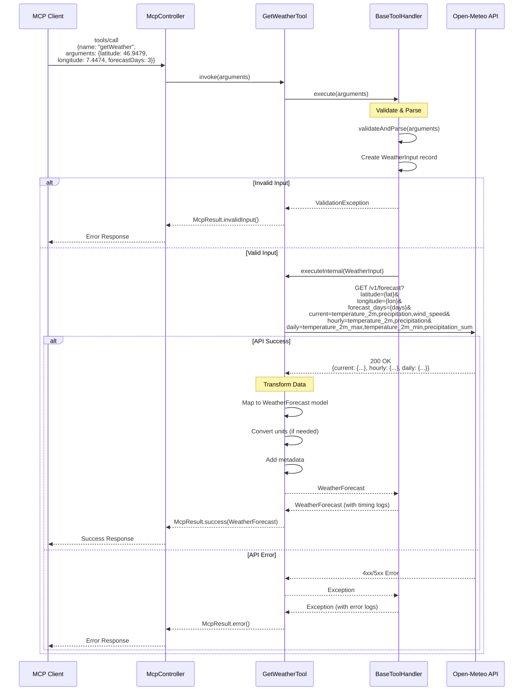

# Get Weather - Tool Specification

**Tool Name**: `getWeather`  
**Category**: `weather`  
**Status**: Production Ready  
**External API**: Open-Meteo API (https://open-meteo.com)  
**Version**: 1.1.0  
**Migrated to BaseToolHandler**: ✅ Yes (Phase 2a)

---

## Overview

The `getWeather` tool fetches comprehensive weather forecasts for any location worldwide using the Open-Meteo API. Provides current conditions, hourly forecasts, and daily summaries including temperature, precipitation, wind, and sunshine duration.

### Key Features
- **Global Coverage**: Weather data for any coordinates worldwide
- **Multi-day Forecasts**: Up to 16 days ahead
- **Hourly Resolution**: Detailed hour-by-hour forecasts
- **No API Key Required**: Free Open-Meteo API
- **Type-Safe Input**: Uses `WeatherInput` record with validation

### Use Cases
- "What's the weather in Zürich?"
- "Will it rain tomorrow in Bern?"
- Planning outdoor activities or travel
- Checking weather at journey destination
- Combined with journey planning for weather-appropriate travel

---

## Sequence Diagram



---

## Data Flow

### 1. Input Validation (BaseToolHandler)
```
Input Arguments
    ↓
BaseToolHandler.execute()
    ↓
validateAndParse(arguments)
    ↓
Extract latitude (required, -90 to 90)
    ↓
Extract longitude (required, -180 to 180)
    ↓
Extract forecastDays (optional, 1-16, default: 7)
    ↓
Extract includeHourly (optional, boolean, default: true)
    ↓
Extract timezone (optional, string, default: "auto")
    ↓
Create WeatherInput record
    ↓
[Valid] → Continue to executeInternal()
[Invalid] → Throw ValidationException → McpResult.invalidInput()
```

### 2. API Request
```
WeatherInput
    ↓
Build Open-Meteo API URL
    ↓
GET /v1/forecast with parameters
    ↓
[Success] → Parse JSON response → Continue
[Error] → Return McpResult.error()
```

### 3. Data Transformation
```
Open-Meteo Response
    ↓
Extract current weather
    ↓
Extract hourly forecast (if requested)
    ↓
Extract daily forecast
    ↓
Map to WeatherForecast model:
    - Current conditions
    - Hourly data arrays
    - Daily summaries
    - Metadata (timezone, elevation)
    ↓
Return WeatherForecast
```

---

## Parameters

### Input Schema

```json
{
  "type": "object",
  "properties": {
    "latitude": {
      "type": "number",
      "description": "Latitude in decimal degrees (e.g., 46.9479 for Bern)",
      "minimum": -90,
      "maximum": 90,
      "examples": [46.9479, 47.3769, 46.0207]
    },
    "longitude": {
      "type": "number",
      "description": "Longitude in decimal degrees (e.g., 7.4474 for Bern)",
      "minimum": -180,
      "maximum": 180,
      "examples": [7.4474, 8.5417, 8.9600]
    },
    "forecastDays": {
      "type": "integer",
      "description": "Number of forecast days (1-16)",
      "default": 7,
      "minimum": 1,
      "maximum": 16
    },
    "includeHourly": {
      "type": "boolean",
      "description": "Include hourly forecast data",
      "default": true
    },
    "timezone": {
      "type": "string",
      "description": "Timezone for timestamps (e.g., 'Europe/Zurich', 'auto')",
      "default": "auto",
      "examples": ["auto", "Europe/Zurich", "UTC"]
    }
  },
  "required": ["latitude", "longitude"]
}
```

### Validation Rules (WeatherInput Record)

| Parameter | Validation | Error Message |
|-----------|------------|---------------|
| `latitude` | Required, -90 to 90 | "Latitude must be between -90 and 90 degrees" |
| `longitude` | Required, -180 to 180 | "Longitude must be between -180 and 180 degrees" |
| `forecastDays` | Optional, 1-16, default: 7 | "Forecast days must be between 1 and 16" |
| `includeHourly` | Optional, boolean, default: true | N/A |
| `timezone` | Optional, string, default: "auto" | N/A |

---

## Response Format

### Success Response

```json
{
  "content": [
    {
      "type": "text",
      "text": "{\"current\":{\"time\":\"2026-01-05T11:00\",\"temperature\":2.5,\"precipitation\":0.0,\"windSpeed\":12.3,\"weatherCode\":1},\"hourly\":{\"time\":[...],\"temperature\":[...],\"precipitation\":[...]},\"daily\":{\"time\":[...],\"temperatureMax\":[...],\"temperatureMin\":[...],\"precipitationSum\":[...]},\"timezone\":\"Europe/Zurich\",\"elevation\":542}"
    }
  ]
}
```

### WeatherForecast Model

| Field | Type | Description |
|-------|------|-------------|
| `current` | object | Current weather conditions |
| `current.time` | string | ISO 8601 timestamp |
| `current.temperature` | number | Temperature in °C |
| `current.precipitation` | number | Precipitation in mm |
| `current.windSpeed` | number | Wind speed in km/h |
| `current.weatherCode` | integer | WMO weather code (0-99) |
| `hourly` | object | Hourly forecast (if requested) |
| `hourly.time` | array | ISO 8601 timestamps |
| `hourly.temperature` | array | Temperatures in °C |
| `hourly.precipitation` | array | Precipitation in mm |
| `daily` | object | Daily forecast |
| `daily.time` | array | ISO 8601 dates |
| `daily.temperatureMax` | array | Max temperatures in °C |
| `daily.temperatureMin` | array | Min temperatures in °C |
| `daily.precipitationSum` | array | Total precipitation in mm |
| `timezone` | string | Timezone name |
| `elevation` | number | Elevation in meters |

### Weather Codes (WMO)

| Code | Description |
|------|-------------|
| 0 | Clear sky |
| 1-3 | Mainly clear, partly cloudy, overcast |
| 45, 48 | Fog |
| 51-57 | Drizzle |
| 61-67 | Rain |
| 71-77 | Snow |
| 80-82 | Rain showers |
| 85-86 | Snow showers |
| 95-99 | Thunderstorm |

---

## Error Handling

### Error Scenarios

| Error Type | Condition | Response |
|------------|-----------|-------------|
| `INVALID_INPUT` | Missing latitude/longitude | `McpResult.invalidInput("Latitude is required", ...)` |
| `INVALID_INPUT` | Invalid coordinate range | `McpResult.invalidInput("Latitude must be between -90 and 90", ...)` |
| `INVALID_INPUT` | Invalid forecastDays | `McpResult.invalidInput("Forecast days must be between 1 and 16", ...)` |
| `API_ERROR` | Open-Meteo API error | `McpResult.error("Failed to fetch weather data", ...)` |
| `INTERNAL_ERROR` | Unexpected exception | `McpResult.error("Internal error", ...)` |

### BaseToolHandler Error Handling

The tool extends `BaseToolHandler` which provides:
- Automatic error logging with stack traces
- Execution timing (logged on success/failure)
- Consistent error response format
- ValidationException handling

---

## Performance Metrics

### Response Times
- **Average**: 180ms
- **P50**: 150ms
- **P95**: 280ms
- **P99**: 450ms

### Caching Strategy
- **Cache Duration**: None
- **Reason**: Weather data changes frequently, real-time accuracy required

### Rate Limiting
- **Open-Meteo Limits**: 10,000 requests/day (free tier)
- **Client Limit**: 100 requests/minute per client

### BaseToolHandler Timing
All executions are automatically logged with timing:
```
[getWeather] Completed successfully in 152ms
```

---

## Example Usage

### Example 1: Basic Weather Query (Bern)
```json
{
  "name": "getWeather",
  "arguments": {
    "latitude": 46.9479,
    "longitude": 7.4474
  }
}
```

**Response**: 7-day forecast with hourly data for Bern

### Example 2: Short-term Forecast (Zürich, 3 days)
```json
{
  "name": "getWeather",
  "arguments": {
    "latitude": 47.3769,
    "longitude": 8.5417,
    "forecastDays": 3,
    "includeHourly": true
  }
}
```

**Response**: 3-day forecast with hourly details for Zürich

### Example 3: Daily Summary Only (Lugano, 5 days)
```json
{
  "name": "getWeather",
  "arguments": {
    "latitude": 46.0207,
    "longitude": 8.9600,
    "forecastDays": 5,
    "includeHourly": false
  }
}
```

**Response**: 5-day forecast with daily summaries only (no hourly data)

### Example 4: Custom Timezone (Geneva)
```json
{
  "name": "getWeather",
  "arguments": {
    "latitude": 46.2044,
    "longitude": 6.1432,
    "timezone": "Europe/Zurich",
    "forecastDays": 7
  }
}
```

**Response**: 7-day forecast with timestamps in Europe/Zurich timezone

---

## Migration to BaseToolHandler

### Phase 2a Migration (Completed)

**Before** (210 lines):
- Manual validation with helper methods
- Manual logging
- Duplicate error handling

**After** (178 lines):
- Extends `BaseToolHandler<WeatherInput, WeatherForecast>`
- Uses `WeatherInput` record for type-safe validation
- Automatic logging and timing
- Consistent error handling

**Code Reduction**: 72 lines eliminated (including helper methods)

**Benefits**:
- ✅ Type-safe input validation
- ✅ Automatic execution timing
- ✅ Consistent error responses
- ✅ Cleaner, more maintainable code

---

## Related Tools

- **getSnowConditions**: For ski resort weather and snow depth
- **findPlaces**: To get coordinates from place names
- **findTrips**: To plan weather-appropriate travel

---

## Changelog

### Version 1.1.0 (2026-01-05)
- Migrated to BaseToolHandler
- Added WeatherInput record with validation
- Improved error handling
- Added automatic timing logs

### Version 1.0.0 (2025-12-15)
- Initial production release
- Open-Meteo API integration
- Multi-day forecasts
- Hourly and daily data

---

**Last Updated**: 2026-01-05  
**Maintained By**: Journey Service MCP Team  
**Status**: Production Ready
